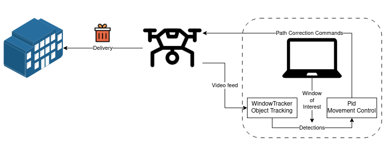
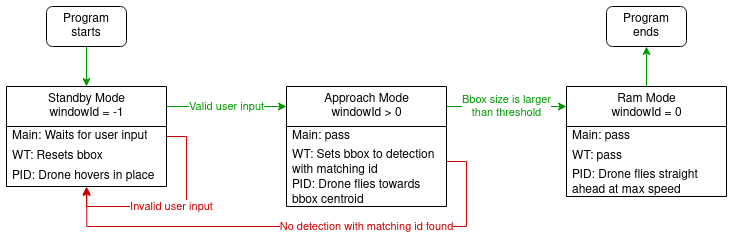
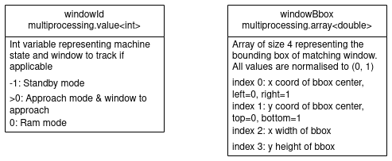

# Racer
**Search and rescue**

**Important note: there were some last minute changes to the code as the tello could not be controlled across multi-processes, so some parts of the documentation may not be accurate. Mainly, the code no longer uses multiprocessing to run windowTracker and Pid concurrently, rather it runs both in a loop, which increases latency slightly. A separate thread is used to receive user input. Also, Pid has not been tested but running Main with Pid disabled works. Enable pid by uncommmenting lines 88-89 in Main.py**


## About the project
We have a present to deliver to someone inside a building. Because they need it urgently, we will attach the present to a drone and fly it into the nearest window as fast as possible.


## Getting started
### Setup
Clone the [`main`](https://github.com/PC6-SV/racer) branch.  
**Training dataset is uploaded to [pc6 google drive](https://drive.google.com/file/d/1Ch3Q_xqshZuwJ7y2l2Cp_HHgavEfINrq/view?usp=drive_link) as the file is too big for Github.**

Follow the instructions on the [Yolov8 documentation](https://docs.ultralytics.com), under *Quickstart* to install Yolov8.

To run Racer using a Tello, follow the instructions on the [Robomaster SDK documentation](https://robomaster-dev.readthedocs.io/en/latest/python_sdk/installs.html) to install Robomaster SDK.

OpenCV is also required but should be automatically installed when you install Yolov8. Check OpenCV version after installation, 4.2.0 and above should be ok.

Here are the summarised setup CLI commands:  
```
git clone https://github.com/PC6-SV/racer
pip install ultralytics
pip install robomaster

python3
import cv2
print(cv2.__version__)
```

### Sanity checks
Some example scripts have been included to verify that your environment is setup correctly. **Run these from the `Racer` directory.**
1. Start by running `track.py`.  
**Note: If no video starts showing on screen after at least 15 seconds from running `track.py`, try running it in a virtual environment instead. Follow the same setup instructions as before.**
2. Try, on your own, to run tracking on a video in the dataset, using one of the custom models trained on window detection (I suggest one of the kaggle_ops models).
    - Refer to the *predict* and *track* sections under *mode* tab of the Yolov8 documentation for more details.
3. Next, connect to a Tello and run `tello_video.py`. You should see the Tello's video feed on your computer.
4. Lastly, run `tello_track.py`. You should see the Tello's video feed overlayed with Yolov8 detections.


## How Racer works


Racer uses python multiprocessing to simultaneously run Yolov8 object tracking on the drone video feed and run PID to guide the drone towards a window.  
There are 3 modes in Racer: standby, approach, and ram:



1. When Racer starts, the drone hovers in place in standby mode and window tracking is performed on the video feed.
2. Out of all the detections, the user specifies the detected window of interest by entering the detection id, and the drone enters approach mode.
3. The bounding box of the window of interest is passed into PID and its deviation from the center of frame is calculated.
4. PID calculates and sends the corrective measures to realign the drone towards the window as it approaches.
5. When the drone gets very close to the window, the drone enters ram mode and flies forward at full speed.  

The program uses two shared variables across the processes to represent the machine state and the window of interest's bounding box.



### Useful links
Here are some useful resources for understanding Racer
1. [Robomaster TT SDK User Guide](https://dl.djicdn.com/downloads/RoboMaster+TT/Tello_SDK_3.0_User_Guide_en.pdf)
2. [Robomaster TT User Manual](https://dl.djicdn.com/downloads/RoboMaster+TT/RoboMaster_TT_Tello_Talent_User_Manual_en.pdf)
3. [Robomaster SDK Development Guide](https://robomaster-dev.readthedocs.io/en/latest/python_sdk/beginner_drone.html)
4. [Yolov8 documentation](https://docs.ultralytics.com)


## Running Racer (on Tello)
Once familiar with Yolov8, Tello, and the Racer process, run Racer to see it in action and the user experience.  

1. Connect to the Tello on both your phone (to teleops it at the start) and your laptop (to run Racer).
2. Verify your laptop's ip address, and update `WindowTracker.py` and `Pid.py` if necessary (might be 192.168.10.3 instead of 192.168.10.2).
3. Start the Tello app on your phone, and you should see the video stream.
4. Run `Main.py` on your laptop. **Once the video stream appears on your laptop, the video stream on your phone stops. It's normal. Use the laptop's stream to pilot the drone.**
5. Using Tello app on your phone, takeoff and fly towards a window until it is detected by WindowTracker on your laptop's video stream. **Fly close enough that the detection stabilises.**
6. Enter the detection id of the window into the terminal prompt.
7. Racer will take over and fly the drone into the window. Sit back and monitor the video feed on your laptop.
8. If WindowTracker happens to lose track of the window, it will prompt you to re-enter a window id again. Enter the new detection id of the same window and Racer will continue to run.
9. When the drone has completed Ram mode, press ESC on your laptop's video stream (might need to hold a few seconds) to stop WindowTracker, and the program will close.

Reasons for WindowTracker losing track of window:
1. Large video stream glitches
2. Extended occlusion of the window
3. Strong winds pushing the Tello until window is out of video frame

Vary the Tello video stream settings (fps and resolution) to find the best configuration that gives low latency on your laptop.


## Problems with the Tello (Known Bugs)
Working with the Tello leads to many problems and can be quite frustrating. Here are some commonly encountered error messages: 
- `queue.Empty`
    - Happens when the drone resources get messed up. For example, if you press ctrl-Z and the resources are not released correctly at the end of a program.
    - When this happens, restart the drone.
- `Address already in use`:
    - Happens when the drone disconnects from the device and the ip was not unassigned (for eg, if you press ctrl-Z).
    - When this happens, close the current terminal and run the script in a new terminal.
- Main.py doesn't terminate
    - Happens when the Tello didn't disconnect properly, thus WindowTracker process cannot terminate properly, and Main.py keeps waiting.
    - Just ctrl-Z, note you might encounter the above errors afterwards.
- `-215:Assertion failed`
    - This happens quite often when Tello video resolution is set to "low" (480p). Not sure what causes it.
    - Try running the program again.


## Some Useful Statistics
Here are some useful statistics about running Yolov8

Running on MSI dev laptop:  
- The initial frame takes ~3s to process, for object detection and tracker initialisation.
- Subsequent frames take ~8ms for inference (excluding ~1.5ms preprocess and ~1.5ms postprocess).
- The MSI can't handle Tello stream of 720p @ 30fps, and will start accumulating latency.
    - Yes, the math doesn't add up (30fps where each frame takes around 11ms to process), but it happens and I don't know why.
    - Lowering either the resolution to 480p ("low") or fps to 15 ("medium") will eliminate the accumulated latency.

Using Tello video feed:
- Video latency (from reality to frame on computer): ~200ms
- Video + track latency (from reality to cv output)
    - Using 720p @ 30fps: Accumulates
    - Using 720p @ 15fps: ~500ms
    - Using 480p @ 30fps: ~200ms